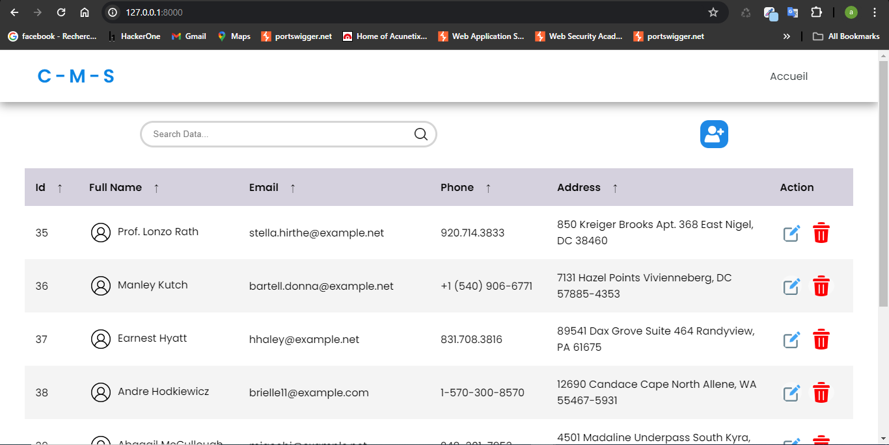
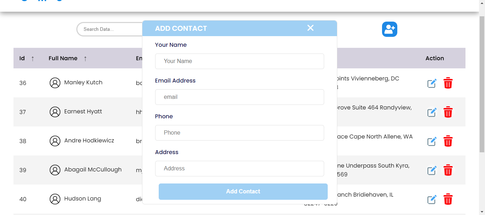
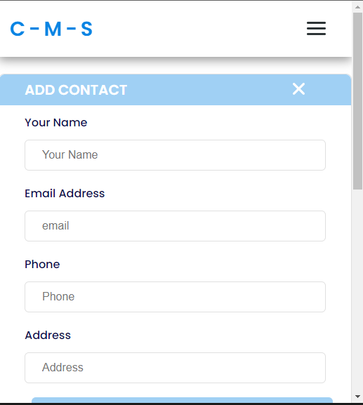
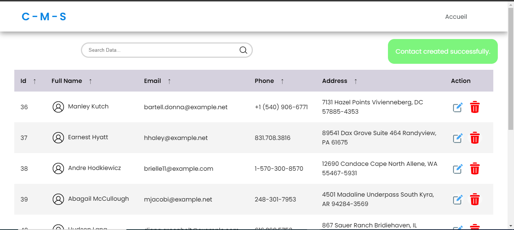
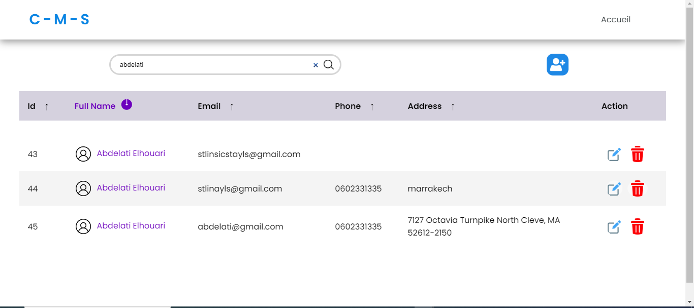
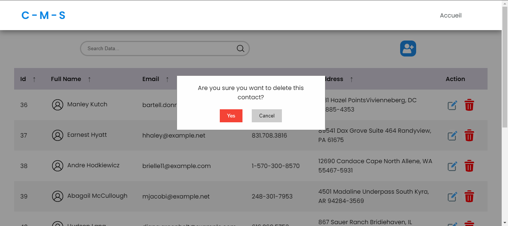
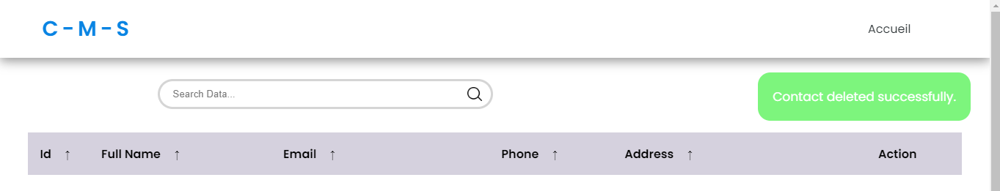

# Contact Management System (CMS) using Laravel

This project is a basic Contact Management System (CMS) developed using Laravel and Mysql. It provides functionalities to manage contacts including creating, viewing, updating, and deleting contacts.

## Navigating the Application

        - **Create Contacts**:  can add new contacts with their name, email, phone, and address.




        - **View Contacts**: Contacts are displayed in a list format, showing their basic information.


        - **Update Contacts**:  can edit the details of existing contacts.


        - **Delete Contacts**: Contacts can be removed from the system if they are no longer needed.



## Setup

To set up and run this project locally, follow these steps:

1. **Clone the Repository**: 
   ```bash
   git clone https://github.com/abdelati-elhouari/contact-management-system.git

2. **Navigate to the Project Directory**:
    cd contact-management-system

3. **Install Dependencies:**:
    composer install
   
4. **Copy the Environment File**:
    cp .env.example .env

5. **Configure Database**:
    Update the database configuration in the .env file with your database credentials.

6. **Run Migrations:**:
    php artisan migrate

7. **Start the Development Server**:
    php artisan serve

9. **Access the Application**:
        Open your web browser and navigate to http://localhost:8000.
